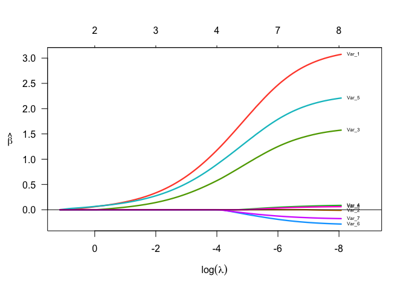

<!-- README.md is generated from README.Rmd. Please edit that file -->

[](https://travis-ci.org/yang0117/TVsMiss)

# TVsMiss

The goal of TVsMiss is to select variable in both low and high demesion
through regularization likelihood method.

## Installation

You can install TVsMiss from github with:

``` r
# install.packages("devtools")
devtools::install_github("yang0117/TVsMiss")
```

## Example

This is a basic example which shows you how to solve a common problem:

``` r
rm(list = ls())
library(TVsMiss)
n <- 50
p <- 8
beta <- c(3,0,1.5,0,2,rep(0,p-5))
xm <- matrix(rnorm(n*p),ncol = p, nrow = n)
y <- xm %*% beta + rnorm(n)
colnames(xm) <- paste0("Var_",1:p)
fit02 <- tvsmiss(x=xm,y=y,method = "BIC")
fit02$selection_beta
#>     Var_1     Var_2     Var_3     Var_4     Var_5     Var_6     Var_7 
#> 0.6412962 0.0000000 0.2346477 0.0000000 0.3752233 0.0000000 0.0000000 
#>     Var_8 
#> 0.0000000
plot(fit02,x.log=TRUE,label = TRUE)
```

<!-- -->
